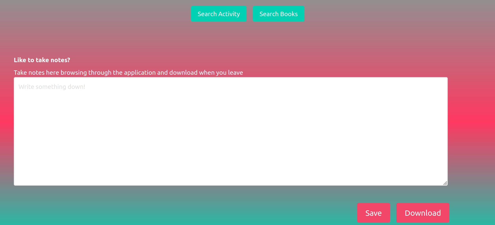
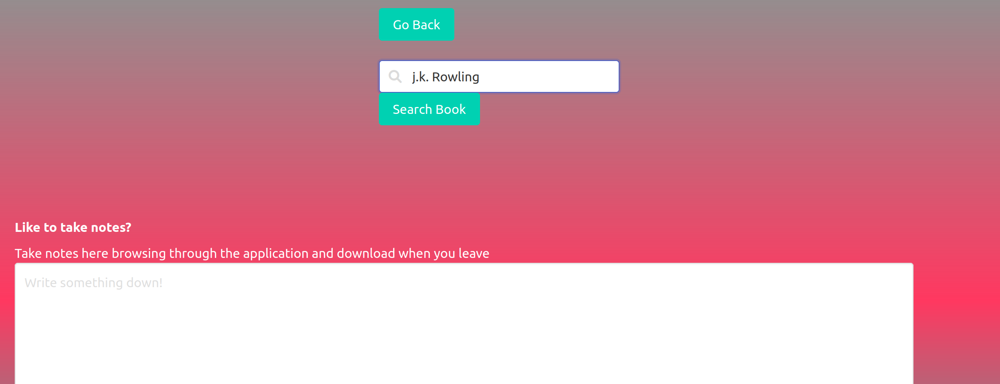
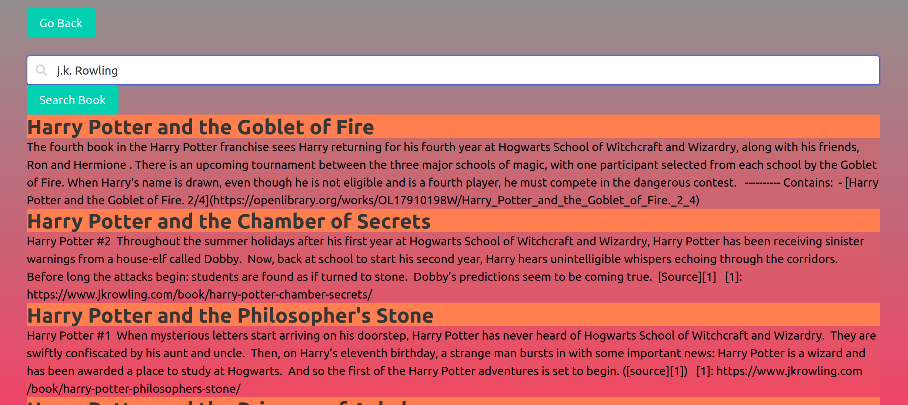
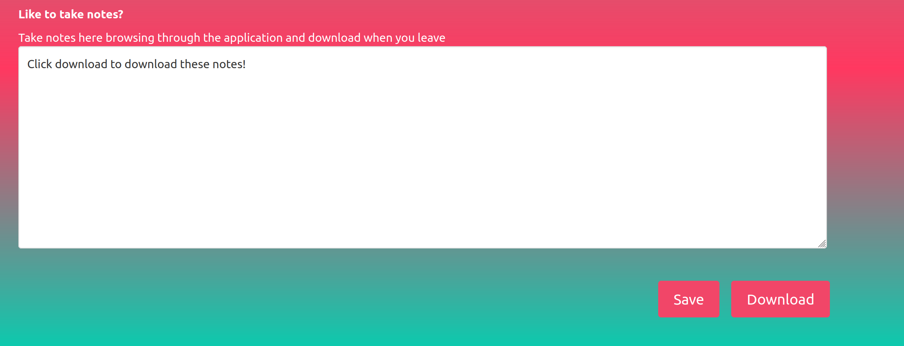

# help-i-am-bored
First group project for MSU Full Stack coding bootcamp.

Made by:
- Satihya Katanguru
- Jordan King
- Thomas Parlmer

# Using help-i-am-bored

1. Start by pressing the help button

2. You will then see the following screen. To search for a book click the "search book" button. To search for an activity click the "search activity" button.

3. Clicking "search activity" will display the following activity.

4. Clicking "next activity" will display another activity. Clicking "go back" will return to the screen displayed in screenshot 2.

5. Clicking "search books" will display an input field. Enter an author name and click the "search book" button.

6. A list of books by the author will display. Clicking "go back" will return to the screen displayed in screenshot 2.

7. While using either the "search activity" or "search book" button you are able scroll down and use the persistent notes area. The notes you take will last even if you switch activities or switch to books. Clicking "download notes" will save them to your local machine.

# Technologies Used
The following technologies were used to build this app:
- HTML
- CSS
- JavaScript
- Bulma CSS Framework 
- Bored API 
- OpenLibrary API 

# Links
View our deployed app [here](https://tparlmer.github.io/help-i-am-bored/)

View our GitHub repo [here](https://github.com/tparlmer/help-i-am-bored)