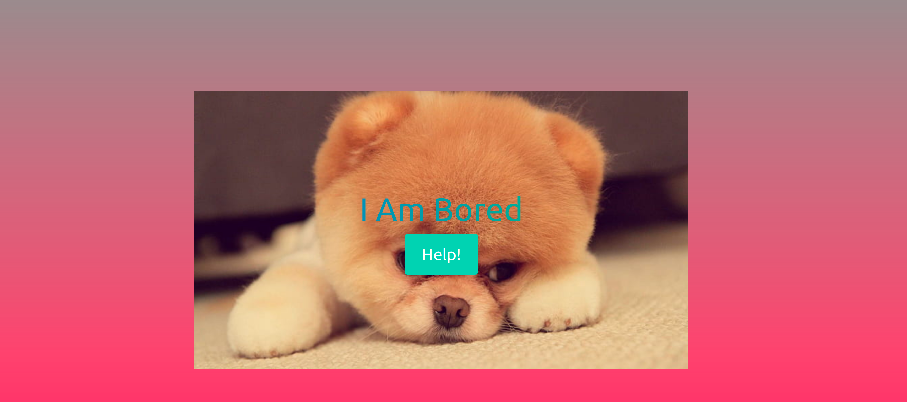
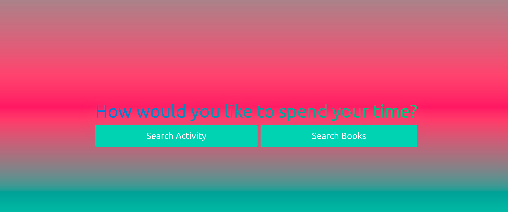

# help-i-am-bored
First group project for MSU Full Stack coding bootcamp.

Made by:
- Sahitya Katanguru
- Jordan King
- Thomas Parlmer

# Description

help-i-am-bored is a boredom relief application. Our team wanted to create something that incorporated the Bored API and Open Library API's into an application that generates recommendations for someone who is bored. The app provides a persistent note textarea, that is saved in local storage. A user can take note on the generated book and activity boredom relief suggestions. The notes can subsequently be downloaded to the users local machine. In the future, there is potential to incorporate more API's to provide the user a greater breadth of boredom solutions.

# Using help-i-am-bored

1. Start by pressing the help button

2. You will then see the following screen. To search for an activity click the "Search Activity" button. To search for a book click the "Search Books" button. 

3. Clicking "Search Activity" will display the following activity.

4. Clicking "Next Activity" will display another activity. Clicking "Go Back" will return to the screen displayed in screenshot 2.

5. Clicking "Search Books" will display an input field. Enter an author name and click the "Search Book" button.

6. A list of books by the author will display. Clicking "Go Back" will return to the screen displayed in screenshot 2.

7. While using either the "Search Activity" or "Search Books" button you are able scroll down and use the persistent notes area. The notes you take will last even if you switch activities or switch to books. Clicking "Download" will save the notes to your local machine.

# Technologies Used
The following technologies were used to build this app:
- HTML
- CSS
- JavaScript
- Bulma CSS Framework 
- Bored API 
- OpenLibrary API 

# Links
View our deployed app [here](https://tparlmer.github.io/help-i-am-bored/)

View our GitHub repo [here](https://github.com/tparlmer/help-i-am-bored)